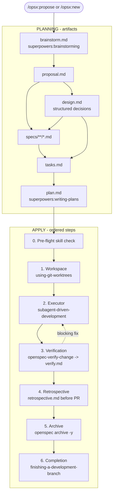

# superpowers-bridge Schema

[](https://github.com/AlekseiSeleznev/openspec-schemas/actions/workflows/validate-schemas.yml)
[](https://github.com/AlekseiSeleznev/openspec-schemas/issues?q=is%3Aopen+label%3Aupstream-version-check)
[](#совместимость)
[](#совместимость)

`superpowers-bridge` соединяет artifact governance [OpenSpec](https://github.com/Fission-AI/OpenSpec) с execution skills из [obra/superpowers](https://github.com/obra/superpowers). OpenSpec отвечает за "что должно быть описано и проверено", Superpowers - за "как дисциплинированно выполнить работу". Интеграция живет на prompt layer: исходники Superpowers и OpenSpec CLI не патчатся.

Schema version: `v1`. Current bundle release: `1.1.2` (см. [VERSION](./VERSION)).

## Установка

OpenSpec ищет schemas в таком порядке:

1. Project-local schema: `<project>/openspec/schemas/<name>/`
2. User-level schema: `${XDG_DATA_HOME:-$HOME/.local/share}/openspec/schemas/<name>/`
3. Package built-in schema

User-level установка подходит, если `superpowers-bridge` нужен во всех локальных проектах. Project-local установка подходит, если проект должен зафиксировать или кастомизировать копию schema. Локальный каталог `openspec/schemas/superpowers-bridge/` всегда перекрывает user-level установку.

### Способ 1: user-level install

```bash
tmp="$(mktemp -d)"
git clone https://github.com/AlekseiSeleznev/openspec-schemas "$tmp/openspec-schemas"

schema_home="${XDG_DATA_HOME:-$HOME/.local/share}/openspec/schemas"
mkdir -p "$schema_home"
rm -rf "$schema_home/superpowers-bridge"
cp -R "$tmp/openspec-schemas/superpowers-bridge" "$schema_home/superpowers-bridge"

rm -rf "$tmp"
openspec schema validate superpowers-bridge
openspec schemas
```

После установки change можно открыть так:

```bash
/opsx:new my-feature --schema superpowers-bridge
```

Если в проекте уже есть `openspec/schemas/superpowers-bridge/`, обновите эту project-local копию или удалите ее, чтобы сработала user-level schema.

### Способ 2: project-local Claude Code prompt

Вставьте в Claude Code из корня проекта:

```text
Install the superpowers-bridge schema for OpenSpec into this project:

1. Verify the project has an `openspec/` directory (run `openspec init` if missing).
2. Clone https://github.com/AlekseiSeleznev/openspec-schemas to a temp dir.
3. Copy the `superpowers-bridge/` subdirectory to `openspec/schemas/superpowers-bridge/`.
4. Run `openspec schema validate superpowers-bridge` to verify.
5. Run `openspec schemas` and confirm `superpowers-bridge` is listed.
6. If a CLAUDE.md exists at the project root, ask me whether to insert the workflow-routing fragment from `openspec/schemas/superpowers-bridge/templates/adopters/CLAUDE.md.fragment.md`. If I say yes, append the fragment as a new section. If no CLAUDE.md exists, skip.
7. Clean up the temp directory.
8. Verify Superpowers plugin is installed by running `claude plugin list`.
   If not listed, run `claude plugin install superpowers@claude-plugins-official`.
9. Show me the final state.
```

### Способ 3: project-local manual bash

```bash
git clone https://github.com/AlekseiSeleznev/openspec-schemas /tmp/oss
cp -R /tmp/oss/superpowers-bridge ~/your-project/openspec/schemas/superpowers-bridge

# Optional: insert workflow-routing fragment into CLAUDE.md
# cat /tmp/oss/superpowers-bridge/templates/adopters/CLAUDE.md.fragment.md

rm -rf /tmp/oss
cd ~/your-project
openspec schema validate superpowers-bridge
claude plugin install superpowers@claude-plugins-official  # if not already
```

## Обновление существующей установки

User-level установку обновляют заменой `${XDG_DATA_HOME:-$HOME/.local/share}/openspec/schemas/superpowers-bridge`. Project-local копию нужно обновлять отдельно, потому что она перекрывает user-level schema.

### User-level upgrade

```bash
tmp="$(mktemp -d)"
git clone https://github.com/AlekseiSeleznev/openspec-schemas "$tmp/openspec-schemas"

schema_home="${XDG_DATA_HOME:-$HOME/.local/share}/openspec/schemas"
mkdir -p "$schema_home"
rm -rf "$schema_home/superpowers-bridge"
cp -R "$tmp/openspec-schemas/superpowers-bridge" "$schema_home/superpowers-bridge"

rm -rf "$tmp"
openspec schema validate superpowers-bridge
openspec schemas
```

### Project-local upgrade

```bash
git clone https://github.com/AlekseiSeleznev/openspec-schemas /tmp/oss-upgrade

# Review before overwrite
diff -ruN ~/your-project/openspec/schemas/superpowers-bridge /tmp/oss-upgrade/superpowers-bridge

# After explicit approval
rm -rf ~/your-project/openspec/schemas/superpowers-bridge
cp -R /tmp/oss-upgrade/superpowers-bridge ~/your-project/openspec/schemas/superpowers-bridge

cd ~/your-project && openspec schema validate superpowers-bridge

# CLAUDE.md fragment, handled manually
# View /tmp/oss-upgrade/superpowers-bridge/templates/adopters/CLAUDE.md.fragment.md
# Compare with your existing CLAUDE.md before inserting or replacing.

rm -rf /tmp/oss-upgrade
```

Upgrade заменяет весь каталог `openspec/schemas/superpowers-bridge/`. Это monolithic bundle: либо берется весь новый bridge, либо остается старая копия. Project root `CLAUDE.md` обновляется только вручную или после явного подтверждения пользователя.

In-flight changes совместимы с graph tightening `v1.1.1`: если уже есть `brainstorm.md`, но нет `proposal.md`, `/opsx:continue` должен разблокировать только `proposal.md`; `design.md` следует после `proposal.md`. Уже созданные `design.md`, `verify.md` и `retrospective.md` остаются читаемыми.

Для `v1.1.2` новые `brainstorm.md` должны содержать закрытый Clarification Gate. Если in-flight change уже имеет старый `brainstorm.md` без gate, `proposal` / `design` instructions должны остановиться и вернуть работу в brainstorm до явного закрытия gate.

## Что решает schema

Без bridge OpenSpec и Superpowers дублируют друг друга:

1. Brainstorming пишет дизайн в `docs/superpowers/specs/`, а OpenSpec заново создает `proposal.md` / `design.md`.
2. `tasks.md` и `plan.md` описывают одну работу на разных уровнях детализации и в разных местах.
3. Пользователь вручную решает, какой skill запускать на каждом шаге.

`superpowers-bridge` делает это одним lifecycle и направляет outputs в `openspec/changes/<name>/`.

## Entry и exit gates

Не каждое изменение требует OpenSpec change.

| Ситуация | Нужен opsx change? | Действие |
|---|---|---|
| Новая feature / capability | Да | `/opsx:new <name> --schema superpowers-bridge` |
| Breaking change | Да | То же |
| Архитектурное изменение | Да | То же |
| Bug fix без изменения контракта | Нет | Direct PR |
| Test backfill / coverage | Нет | Direct PR |
| Linter, build tooling, non-breaking dependency upgrade | Нет | Direct PR |
| Documentation / typo / config value tweak | Нет | Direct PR |

Принцип: процесс должен быть пропорционален риску. Внешний контракт, cross-system integration, DB schema, compliance boundary - через change. Локальный фикс, typo или настройка timeout - direct PR.

Если разговор начался как verbal brainstorm, не пишите результат в `docs/superpowers/specs/`. Продолжайте устно и задавайте по одному прямому вопросу, пока не выполнены все 7 условий:

1. Scope закрыт: одной фразой понятно, что входит и что не входит.
2. Главные design forks разрешены: альтернативы рассмотрены, выбран один путь.
3. Cross-system dependencies размечены как ready / mockable / non-blocking unknown с owner и причиной, почему это не блокирует downstream artifacts.
4. Acceptance criteria можно перечислить конкретно.
5. Capability list можно назвать без guessing.
6. Blocking TBD отсутствуют: нет неизвестных, которые могут изменить proposal, design, specs, tasks, plan или apply.
7. Последние реплики явно подтверждают направление, а не открывают новые forks.

Когда все условия выполнены, модель может предложить `/opsx:propose`, но promotion всегда требует явного подтверждения пользователя.

Front-door anti-patterns:

- Brainstorming пишет в `docs/superpowers/specs/` после установки schema.
- Writing-plans пишет в `docs/superpowers/plans/`.
- Opsx change открывается при blocking TBD.
- Change открывается для bug fix / typo / config tweak.

## Workflow и порядок artifact

Artifact DAG:

```text
brainstorm -> proposal -> design -> specs -> tasks -> plan -> [apply] -> verify -> retrospective
```

Planning порядок enforced в `schema.yaml`:

- `proposal.requires: [brainstorm]`
- `design.requires: [proposal]`
- `specs.requires: [proposal, design]`
- `tasks.requires: [specs, design]`
- `plan.requires: [tasks]`

Из-за этого после `brainstorm.md` ready только `proposal.md`; `design.md` не может быть создан раньше `proposal.md`. Даже если `/opsx:continue` получает несколько ready artifacts от `openspec status --json`, безопасный tie-breaker выбирает по порядку `artifacts:` в активной schema, а не по случайному порядку JSON.

### Lifecycle



Timing notes:

- Planning order больше не зависит от порядка ready artifacts в `/opsx:continue`.
- `verify.md` имеет `requires: [plan]` только как file-existence edge, но фактически создается после apply.
- `retrospective.md` имеет `requires: [verify]` и пишется после successful verify, до PR.
- Полное engine-level исправление для post-apply artifacts требует upstream `post_apply` phase.

## Superpowers touchpoints

| # | Skill | Где вызывается |
|---|---|---|
| 1 | `superpowers:brainstorming` | `brainstorm` artifact |
| 2 | `superpowers:writing-plans` | `plan` artifact |
| 3 | `superpowers:using-git-worktrees` | apply step 1 |
| 4 | `superpowers:subagent-driven-development` | apply step 2 |
| 5 | `superpowers:test-driven-development` | transitive внутри step 2 |
| 6 | `superpowers:requesting-code-review` | transitive внутри step 2 |
| 7 | `superpowers:finishing-a-development-branch` | apply step 6 |

`executing-plans` не используется как fallback: он не активирует TDD и code review транзитивно, поэтому такой fallback незаметно ослабил бы workflow. Если runtime не поддерживает subagents, используйте built-in `spec-driven`.

## Brainstorm hardening

`brainstorm` вызывает `superpowers:brainstorming`, но добавляет OpenSpec-safe слой:

- mandatory clarification gate: brainstorm задает по одному прямому вопросу, пока scope, domain model, design forks, capabilities, acceptance criteria и user-approved direction не закрыты явно;
- grilling decision tree: по одному unresolved design fork за раз, с recommended answer и trade-off;
- domain-modeling pass: terms, identities, ownership boundaries, lifecycle states, invariants, edge cases и glossary conflicts;
- evidence before assumptions: проверять project files и official docs до принятия проверяемых фактов;
- blocking TBD discipline: blocking unknowns запрещают завершать brainstorm; non-blocking TBD допустимы только с owner, impact scope, причиной почему они не блокируют downstream artifacts, и blocking phase `none`.

`brainstorm.md` создается только после закрытого Clarification Gate и явного подтверждения validated direction пользователем. Файл остается raw capture: после raw части добавляется `## OpenSpec Capture Summary` с Clarification Gate, Evidence Checked, Domain Model, Grilling Decision Tree, Resolved Decisions, Rejected Alternatives, Risks / Trade-offs, Non-Blocking TBDs, Documentation Candidates и Validated Direction. `proposal.md` извлекает scope и capabilities из summary. `design.md` читает `brainstorm.md` как главный источник решений и использует `proposal.md` только как scope/capability context.

## Использование

### Быстрый flow

```bash
/opsx:ff my-feature
/opsx:apply
/opsx:verify
/opsx:continue
/opsx:archive
```

### Step-by-step flow

```bash
/opsx:new my-feature --schema superpowers-bridge
/opsx:continue         # brainstorm
/opsx:continue         # proposal
/opsx:continue         # design
/opsx:continue         # specs
/opsx:continue         # tasks
/opsx:continue         # plan
/opsx:apply            # implementation
/opsx:verify           # verify.md
/opsx:continue         # retrospective.md
/opsx:archive
```

### Вернуться к spec-driven

```bash
/opsx:new my-simple-fix --schema spec-driven
```

или выставить default schema в `openspec/config.yaml`.

## Apply phase

`/opsx:apply` следует `apply.instruction` в [schema.yaml](./schema.yaml):

1. **Pre-flight** - проверить наличие required Superpowers skills и project CLI tools.
2. **Workspace** - вызвать `superpowers:using-git-worktrees`.
3. **Executor** - вызвать `superpowers:subagent-driven-development`; subagents работают по `plan.md`, обновляют `tasks.md`, используют TDD и code review.
4. **Verification** - создать `verify.md` через `openspec-verify-change`, исправить blocking issues и перезапустить verify при необходимости.
5. **Retrospective** - написать `retrospective.md`, пока контекст свежий, до PR.
6. **Archive** - выполнить `openspec archive -y`, синхронизировать delta specs и переместить change в archive.
7. **Completion** - вызвать `superpowers:finishing-a-development-branch`; PR открывается только после retro + archive.

## CLI cheat sheet

| Сценарий | Команда |
|---|---|
| Новый интерактивный change | `/opsx:new <name> --schema superpowers-bridge`, затем `/opsx:continue` |
| Новый one-shot change | `/opsx:ff <name>` |
| Продолжить change | `/opsx:continue <name>` |
| Реализация | `/opsx:apply <name>` |
| Verify | `/opsx:verify <name>` |
| Archive | `/opsx:archive <name>` |
| Built-in schema | `/opsx:new <name> --schema spec-driven` |
| Список schemas | `openspec schemas` |
| Статус change | `openspec status --change <name> --json` |
| Активные changes | `openspec list` |
| Полная валидация | `openspec validate --all --json` |

## Design touches

### 1. Skill PRECHECK

Каждый artifact / apply step, который вызывает Superpowers skill, сначала проверяет, что skill доступен в списке skills LLM. Missing skill = STOP без silent fallback.

### 2. Prompt-level integration

Bridge реализован через `instruction:` в schema. Он не патчит Superpowers и OpenSpec CLI. Если skill переименуют или удалят, меняется schema; если меняется внутренняя логика skill, bundle не должен vendor-ить ее копию.

### 3. Explicit transitive dependencies

`subagent-driven-development` внутри активирует TDD и code review. Schema прямо документирует это, чтобы apply phase был читаемым без открытия SKILL.md.

### 4. Subagent platforms only

Schema рассчитана на Claude Code, Codex и другие runtime с subagents. Для runtime без subagents используйте `spec-driven`.

### 5. Evidence-based PRECHECK

`verify` и `retrospective` проверяют observable state командами вроде `git log`, `grep` и чтением `verify.md`. Это mitigation для того, что OpenSpec graph пока не умеет post-apply state machine.

### 6. Post-apply timing mismatch

`verify.requires: [plan]` и `retrospective.requires: [verify]` являются file-existence dependencies. Реально оба artifact создаются после apply. Это известное ограничение v1, пока в OpenSpec нет `post_apply`.

## Версионирование

| Identifier | Где | Значение |
|---|---|---|
| Schema major | `schema.yaml: version: 1` | Contract graph: artifacts, `requires:` edges, PRECHECK shape |
| Bundle release | `VERSION` + git tag | SemVer release bundle внутри schema major |

`1.x.y` - release для schema major `v1`. Будущий `v2` начнет bundle releases с `2.0.0`.

## Совместимость

Baseline versions, против которых писалась schema. Это historical snapshot, а не автоматическая гарантия end-to-end совместимости: prompt-layer workflow полностью не прогоняется в headless CI.

| superpowers-bridge | OpenSpec CLI | Superpowers plugin | Baseline as of |
|---|---|---|---|
| v1 | `1.4.1` | `v5.1.0` | 2026-06-10 |

Проверка состоит из трех уровней:

| Уровень | Механизм |
|---|---|
| Structural | `validate-schemas.yml` на push/PR и weekly `version-check.yml` против latest OpenSpec |
| Drift notification | `version-check.yml` открывает или обновляет issue с label `upstream-version-check`, когда baseline отстает |
| End-to-end workflow | Ручная проверка maintainer-ом после upstream drift |

## Известные schema behavior changes

- **v1.1.2** - `brainstorm` tightened to require an explicit Clarification Gate before `brainstorm.md` can be written. Blocking TBDs now prevent brainstorm completion; non-blocking TBDs must be classified with owner, impact scope, non-blocking reason and blocking phase `none`. Manual fallback for `brainstorm` removed so the Superpowers question loop remains mandatory.
- **v1.1.1** - planning order tightened to match documented lifecycle: `design.requires` изменен с `[brainstorm]` на `[proposal]`, `specs.requires` изменен с `[proposal]` на `[proposal, design]`. Migration не требует rewrite файлов; in-flight changes продолжают создание недостающего predecessor.

## Почему так

### Почему `brainstorm` - artifact, а не hook

Brainstorming интерактивный и multi-turn. Artifact дает trackability через `openspec status` и explicit dependency для downstream artifacts.

### Почему `plan` отдельно от `tasks`

`tasks.md` - coarse checklist для progress tracking. `plan.md` - micro-steps для executor/subagents. Apply требует `plan`, а `tracks: tasks.md` показывает coarse progress.

### Fallback strategy

- `brainstorm`: manual fallback внутри этой schema нет. Если `superpowers:brainstorming` отсутствует, нужно установить Superpowers или использовать другой workflow; иначе нельзя честно гарантировать question loop и закрытый Clarification Gate.
- `plan`: PRECHECK останавливается, после чего пользователь может явно решить написать artifact вручную.
- `apply`: manual fallback внутри этой schema нет. Если required skill отсутствует, нужно установить Superpowers или использовать `spec-driven`.

## Related

- [schema.yaml](./schema.yaml) - machine-readable schema definition
- [templates/](./templates/) - Markdown templates per artifact
- [obra/superpowers](https://github.com/obra/superpowers) - Superpowers skill source
- [Fission-AI/OpenSpec](https://github.com/Fission-AI/OpenSpec) - OpenSpec
- [OpenSpec PR #970](https://github.com/Fission-AI/OpenSpec/pull/970) - исходный review thread
